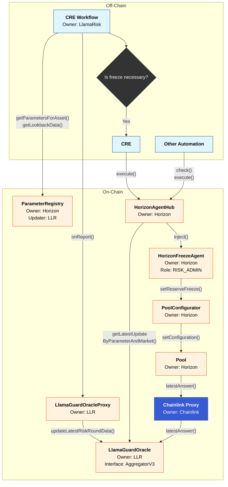
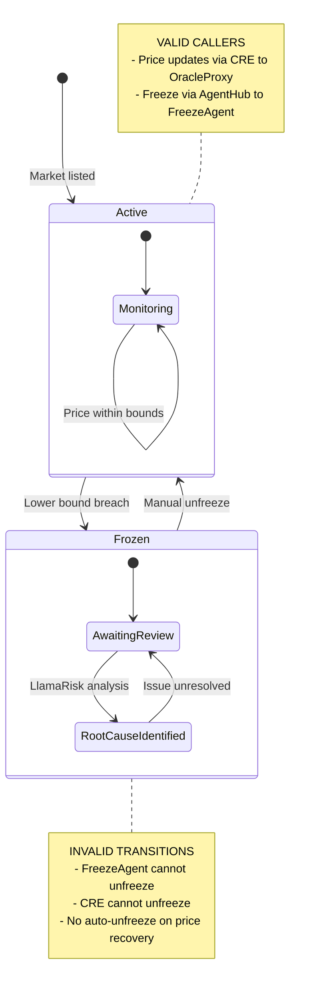

# Architecture

## Introduction

This document describes the onchain architecture for integrating the LlamaGuard NAV oracle solution with Aave Horizon
markets. The architecture leverages the Agent Hub framework authored by BGD Labs to enable automated market protection
when price bounds are breached.

The Agent Hub framework provides a robust, audited infrastructure for managing automated parameter changes in Aave
protocol deployments. By adopting this architecture, we benefit from a proven system that has undergone extensive
security review while maintaining composability with existing Aave risk management patterns.

## Architecture Overview

The system is divided into two primary layers: off-chain components that handle data processing and decision logic, and
on-chain components that execute protective actions on the Horizon protocol.

### Off-Chain Components

**CRE Workflow (Owner: LlamaRisk)**

The Chainlink Runtime Environment (CRE) workflow serves as the primary engine. It performs the following operations:

- Retrieves risk parameters from the ParameterRegistry via `getParametersForAsset()` and `getLookbackData()`
- Processes NAV data from asset issuers and validates against configured price bounds
- Determines whether protective action (market freeze) is necessary based on bound breach detection
- Pushes validated price and state updates to the LlamaGuardOracle via `updateLatestRiskRoundData()`
- Triggers the HorizonAgentHub via `execute()` when a freeze action is required

**CRE Execution Layer**

When the CRE Workflow determines that a freeze is necessary, a separate CRE can call the HorizonAgentHub to trigger the
appropriate agent action.

**Other Automation**

The architecture supports additional automation systems that can interact with the HorizonAgentHub through the standard
`check()` and `execute()` interface. These permissionless functions are already available at the AgentHub. 3rd party
automations can be easy to onboard. AgentHub already oversees Chainlink and Gelato automations.

### On-Chain Components

**ParameterRegistry (Owner: Horizon, Updater: LlamaRisk)**

The ParameterRegistry stores the risk parameters that govern LlamaGuard NAV behavior for each supported asset. LlamaRisk
maintains updater rights to configure and adjust parameters, while Horizon retains ownership for governance oversight.
The CRE Workflow reads from this registry to obtain current bound configurations and lookback data for validation logic.

**LlamaGuardOracle (Owner: LlamaRisk, Interface: AggregatorV3)**

The LlamaGuardOracle serves dual purposes:

1. **Price Feed**: Implements the Chainlink AggregatorV3 interface for validated NAV prices
2. **State Management**: Stores the current validation state, indicating whether bounds have been breached

The CRE Workflow writes updates to this oracle, and the HorizonAgentHub reads from it to determine the current state
when deciding whether to execute agent actions.

**Chainlink Proxy (Owner: Chainlink)**

The Chainlink Proxy sits between the Horizon Pool and the LlamaGuardOracle. The Pool reads validated NAV prices via
`latestAnswer()` from this proxy, which delegates to the underlying LlamaGuardOracle. This architecture maintains
compatibility with standard Chainlink oracle infrastructure while allowing LlamaRisk to manage the underlying oracle
implementation.

**LlamaGuardOracleProxy (Owner: LlamaRisk)**

The proxy contract acts as a secure receiver for Chainlink CRE reports. It validates incoming workflow metadata
(forwarder address, author, workflow name) before forwarding validated updates to the underlying LlamaGuardOracle.

**HorizonAgentHub (Owner: Horizon)**

The HorizonAgentHub is the central coordination contract for all automated parameter management. It provides:

- A single point of control for managing multiple agents
- Standardized interface for triggering agent actions via `inject()`
- Visibility into agent configurations and execution history
- The owner controls Horizon to monitor and manage agent permissions

The Hub reads the latest update state from the LlamaGuardOracle via `getLatestUpdateByParameterAndMarket()` and routes
execution to the appropriate agent.

**HorizonFreezeAgent (Owner: Horizon, Role: RISK_ADMIN)**

The HorizonFreezeAgent is a specialized agent registered with the HorizonAgentHub that handles market freeze operations.
When triggered:

1. The agent receives the freeze command from the Hub
2. It validates the freeze request (state=1, market not already frozen)
3. It calls `setReserveFreeze()` on the PoolConfigurator
4. The PoolConfigurator updates the Pool configuration to freeze the necessary market

The agent holds the RISK_ADMIN role, which permits it to modify reserve configurations via the standard Aave access
control system.

**Pool and PoolConfigurator (Owner: Horizon)**

These are standard Aave V3 protocol contracts. The Pool reads asset prices via `latestAnswer()` from the Chainlink
Proxy, which delegates to the LlamaGuardOracle. The PoolConfigurator receives freeze commands from authorized agents and
applies the configuration change to the Pool via `setConfiguration()`.

## Data Flow Diagram



## Execution Flows

### Regular Operation (No Breach)

1. CRE Workflow reads current parameters from ParameterRegistry
2. CRE Workflow fetches NAV data from asset issuer endpoints (the same mechanism that currently powers Chainlink RWA
   Oracles)
3. CRE Workflow validates NAV against configured bounds
4. If within bounds, CRE Workflow updates LlamaGuardOracle with new price and normal state
5. Horizon Pool reads the validated price via `latestAnswer()` from the Chainlink Proxy for lending operations

### Freeze Trigger (Lower Bound Breach)

1. CRE Workflow detects NAV breach of the lower bound
2. CRE Workflow updates LlamaGuardOracle with price and breach state
3. CRE triggers HorizonAgentHub `execute()` function
4. HorizonAgentHub reads state from LlamaGuardOracle
5. HorizonAgentHub calls `inject()` to trigger HorizonFreezeAgent
6. HorizonFreezeAgent validates the request and calls `setReserveFreeze()` on PoolConfigurator
7. PoolConfigurator applies the freeze configuration to the Pool
8. The market is frozen, preventing new loan originations until manual review

### Unfreeze Process

Market unfreezing is intentionally excluded from automated flows. When a freeze occurs:

1. LlamaRisk performs root cause analysis on the bound breach
2. LlamaRisk coordinates with Horizon and relevant stakeholders
3. Horizon Operations Multisig manually unfreezes the market only after the root cause is resolved (either the issuer
   corrects their reporting, or the price bounds are reconfigured to reflect changed market conditions such as
   insolvencies, credit events, or structural changes to the underlying asset)
4. Previous supply and borrow cap configurations are restored

This manual process ensures that unfreezing receives appropriate review and prevents premature reactivation of
potentially compromised markets.

## State Machine Diagram



## Access Control Model

| Contract              | Owner     | Key Roles/Permissions              |
| --------------------- | --------- | ---------------------------------- |
| ParameterRegistry     | Horizon   | Updater: LlamaRisk                 |
| LlamaGuardOracle      | LLR       | WRITER_ROLE: LlamaGuardOracleProxy |
| LlamaGuardOracleProxy | LLR       | Validates CRE workflow metadata    |
| Chainlink Proxy       | Chainlink | Delegates to LlamaGuardOracle      |
| HorizonAgentHub       | Horizon   | Manages agent registration         |
| HorizonFreezeAgent    | Horizon   | RISK_ADMIN on PoolConfigurator     |
| Pool/PoolConfigurator | Horizon   | Standard Aave V3 ACL               |

<details>
<summary>Technical Details</summary>

**Role Constants**

```solidity
// AbstractReadWriteAccessController
bytes32 public constant WRITER_ROLE = keccak256("WRITER_ROLE");
bytes32 public constant READER_ROLE = keccak256("READER_ROLE");
```

**Access Control Patterns**

- **ParameterRegistry**: Uses `Ownable2Step` for two-step ownership transfer. Owner can set updater; only updater can
  modify asset parameters.
- **LlamaGuardOracle**: Uses OpenZeppelin `AccessControl`. `WRITER_ROLE` required for `updateLatestRiskRoundData()`.
- **HorizonFreezeAgent**: `onlyAgentHub` modifier restricts `inject()` calls to the registered AgentHub.

**Key Data Structures**

```solidity
// RiskParameterUpdate (stored in LlamaGuardOracle)
struct RiskParameterUpdate {
    uint256 timestamp;
    bytes newValue;           // ABI-encoded price (int256)
    string referenceId;
    bytes previousValue;
    string updateType;        // e.g., "boundedNAV"
    uint256 updateId;         // Equals roundId
    address market;
    bytes additionalData;     // (int256 lowerBound, int256 upperBound, uint256 freezeState)
}

// AssetConfig (stored in ParameterRegistry)
struct AssetConfig {
    string name;
    address oracle;
    bool exists;
    uint80 lookbackWindowSize;
    uint64 maxExpectedApy;        // BPS format
    uint32 lowerBoundTolerance;   // BPS format
    uint32 upperBoundTolerance;   // BPS format
    uint32 maxDiscount;           // BPS format
    bool isUpperBoundEnabled;
    bool isLowerBoundEnabled;
    bool isActionTakingEnabled;
}
```

**Parameter Limits (Basis Points)**

- MAX_EXPECTED_APY_LIMIT: 20,000 BPS (200%)
- MAX_UPPER_BOUND_TOLERANCE: 250 BPS (2.5%)
- MAX_LOWER_BOUND_TOLERANCE: 250 BPS (2.5%)
- MAX_DISCOUNT_LIMIT: 250 BPS (2.5%)

</details>
