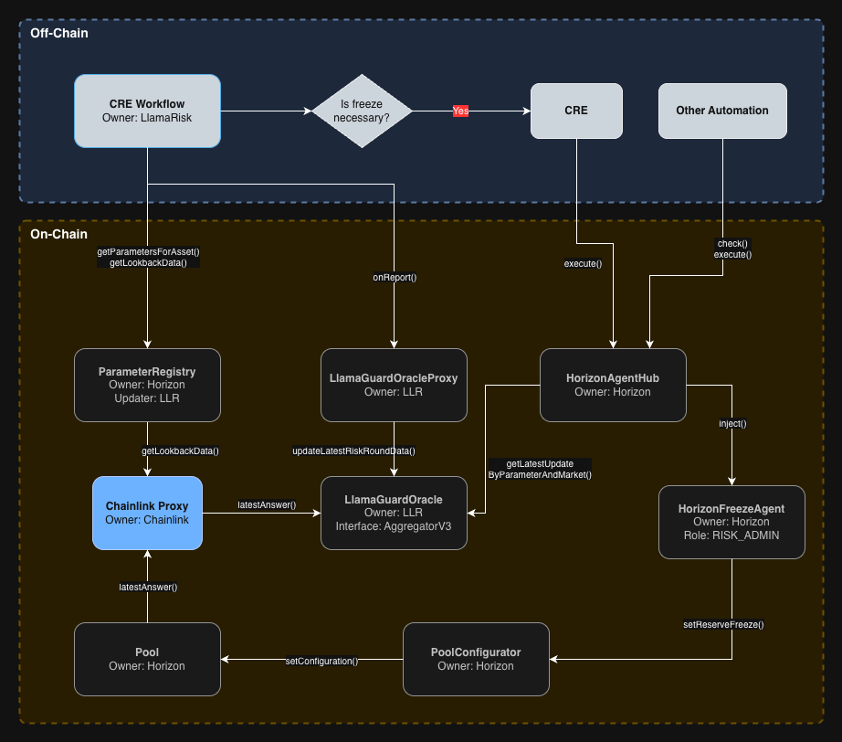
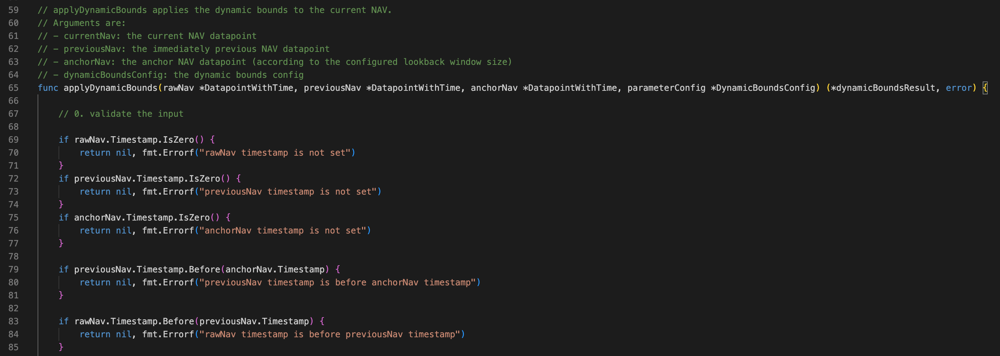
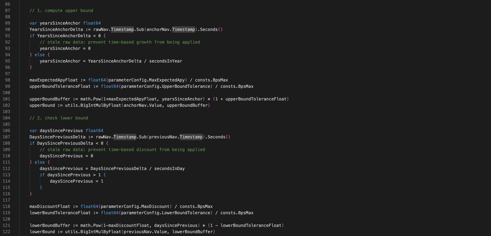
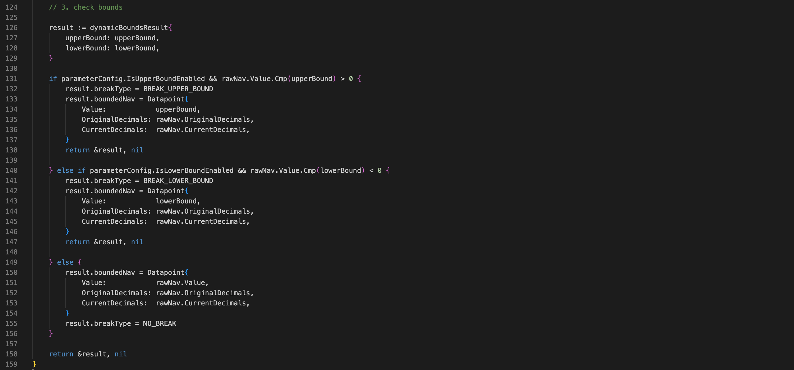

# LlamaGuardNAV V3 CRE Overview

This document provides an overview of the architecture and execution flow for LlamaGuardNAV V3 CRE, which leverages
Chainlink CRE to push bounded NAV values onchain and provide a secure price oracle for DeFi applications.

# Architecture Diagram



**Note:** In the above diagram, the `LlamaGuardOracleProxy` contract is not displayed for simplicity, but sits between
the CRE workflow and the `LlamaGuardOracle` contract. This contract acts as an interface and access control layer
between the CRE workflow and the `LlamaGuardOracle` co

# CRE Workflow pseudo-code

```none
// CRE WORKFLOW
// Triggered whenever the underlying raw NAV feed updates.
Function Run():

    raw_nav, previous_nav, anchor_nav, parameters = FETCH_INPUTS()

    bounded_nav, upper_bound, lower_bound, state = apply_dynamic_bounds(
        raw_nav, previous_nav, anchor_nav, parameters)

    tx_result = write_to_oracle(bounded_nav, upper_bound, lower_bound, state)

    RETURN tx_result
```

The CRE workflow is triggered whenever the underlying raw NAV feed from Chainlink receives a new round. As a result, the
LlamaGuardOracle contract essentially mirrors the Chainlink raw NAV price feed.

The `parameters` comes from the `ParameterRegistry` contract that contains the parameters for the bounding methodology,
and that is already **deployed and used onchain**.

# Core bounding methodology

Here is the core bounding methodology performed by the CRE workflow.

We first perform some basic verifications on the input:



Then we compute the upper and lower bounds:



Finally, we bound the raw NAV if it is out of the computed bounds:



# Step-by-Step Process

The complete flow can be split into two separate processes.

### Workflow Execution and Oracle Write

The first process involves the workflow executing and writing to the LlamaGuardOracle:

1. The Chainlink raw NAV price feed is updated.
2. The CRE workflow is triggered through a log trigger (watching the `RoundDataUpdated` event).
3. The CRE workflow pushes the next bounded NAV value to the `LlamaGuardOracle` contract through the
   `LlamaGuardOracleProxy` contract.
4. The `LlamaGuardOracleProxy` validates that the CRE workflow is authorized to write to the `LlamaGuardOracle` contract
   by verifying the address of the Chainlink `Forwarder` contract, the address of the workflow `author`, the
   `workflowName`, and the `workflowId`.
5. The `LlamaGuardOracle` contract receives the new round of data from the `LlamaGuardOracleProxy` contract.

### Check and Injection

The second process involves injecting the latest round of data from the `LlamaGuardOracle` contract into the configured
DeFi protocol through the `HorizonAgentHub` and `HorizonFreezeAgent` contracts:

1. An external automation checks if specific `agentId`s should be triggered by calling the `check()` method on the
   `HorizonAgentHub` contract.
2. If `HorizonAgentHub` returns true, the automation calls `execute()` on the `HorizonAgentHub` contract, providing the
   specific `agentId`s to execute as parameters.
3. The `HorizonAgentHub` contract validates the latest data from the `LlamaGuardOracle` contract and calls the
   `inject()` method on the `HorizonFreezeAgent` contract.
4. The `HorizonFreezeAgent` contract verifies whether the freeze should be performed. If yes, it calls the `setFreeze()`
   method on the `PoolConfigurator` contract that belongs to Horizon.
